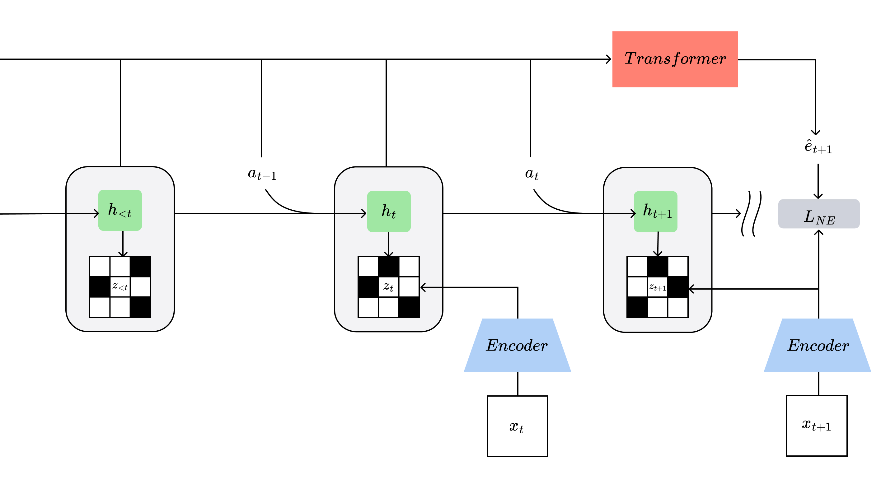

<h2 align="center"> NE-Dreamer: Next Embedding Prediction Makes World Models Stronger </h2>

<div align="center">

`George Bredis` | `Nikita Balagansky` | `Daniil Gavrilov` | `Ruslan Rakhimov` 

[](https://arxiv.org/pdf/2603.02765)
[](https://github.com/corl-team/nedreamer)


</div>


This is the official implementation of the paper "Next Embedding Prediction Makes World Models Stronger" (NE-Dreamer). NE-Dreamer is a decoder-free model-based reinforcement learning agent that leverages a temporal transformer to predict next-step encoder embeddings from latent state sequences, directly optimizing temporal predictive alignment in representation space.

## Key Features

- **Decoder-free architecture**: Learns coherent, predictive state representations without reconstruction losses or auxiliary supervision
- **Temporal predictive alignment**: Uses next-embedding prediction with a causal temporal transformer to enforce long-horizon structure
- **Strong performance**: Matches or exceeds DreamerV3 on DeepMind Control Suite and achieves substantial gains on challenging DMLab tasks involving memory and spatial reasoning
- **Efficient training**: Removes the computational burden of pixel-level reconstruction while maintaining or improving performance

<div align="center">

<p align="center">
  
</p>
</div>

## Setup

This code is tested with Python 3.11 on Ubuntu 20.04. Install the dependencies with:

```bash
pip install -r requirements.txt
```

For DMLab tasks, additional dependencies are required:

```bash
pip install -r requirements_dmlab.txt
```

## Usage

### Quick Start

#### Training on DeepMind Control Suite (DMC)

To train NE-Dreamer on a DMC task:

```bash
python3 train.py \
    env.task=dmc_walker_walk \
    model.rep_loss=ne_dreamer \
    device=cuda:0 \
    seed=0 \
    logdir=./logdir/ne_dreamer_walker_walk
```

#### Training on DeepMind Lab (DMLab)

For DMLab tasks, specify the DMLab environment configuration:

```bash
python3 train.py \
    env=dmlab_vision \
    env.task=dmlab_rooms_collect_good_objects_train \
    model.rep_loss=ne_dreamer \
    device=cuda:0 \
    seed=0 \
    logdir=./logdir/ne_dreamer_dmlab_rooms
```

### Algorithm Selection

You can switch between different algorithms by changing the `model.rep_loss` argument:

| Algorithm         | `model.rep_loss` option |
| ----------------- | ----------------------- |
| NE-Dreamer        | `ne_dreamer`            |
| R2-Dreamer        | `r2dreamer`             |
| DreamerPro        | `dreamerpro`            |
| DreamerV3         | `dreamer`               |


## Available Tasks

### DeepMind Control Suite (DMC)

- `dmc_acrobot_swingup`
- `dmc_ball_in_cup_catch`
- `dmc_cartpole_balance`
- `dmc_cartpole_balance_sparse`
- `dmc_cartpole_swingup`
- `dmc_cartpole_swingup_sparse`
- `dmc_cheetah_run`
- `dmc_finger_spin`
- `dmc_finger_turn_easy`
- `dmc_finger_turn_hard`
- `dmc_hopper_hop`
- `dmc_hopper_stand`
- `dmc_pendulum_swingup`
- `dmc_quadruped_run`
- `dmc_quadruped_walk`
- `dmc_reacher_easy`
- `dmc_reacher_hard`
- `dmc_walker_run`
- `dmc_walker_stand`
- `dmc_walker_walk`

### DeepMind Lab (DMLab)

#### Rooms Tasks (Memory & Navigation)
- `dmlab_rooms_collect_good_objects_train`
- `dmlab_rooms_exploit_deferred_effects_train`
- `dmlab_rooms_select_nonmatching_object`
- `dmlab_rooms_watermaze`

#### Other DMLab Tasks
See `run_dmlab.sh` for the complete list of available DMLab tasks.

## Citation

If you use NE-Dreamer in your research, please cite:

```bibtex
@misc{bredis2026embeddingpredictionmakesworld,
      title={Next Embedding Prediction Makes World Models Stronger}, 
      author={George Bredis and Nikita Balagansky and Daniil Gavrilov and Ruslan Rakhimov},
      year={2026},
      eprint={2603.02765},
      archivePrefix={arXiv},
      primaryClass={cs.LG},
      url={https://arxiv.org/abs/2603.02765}, 
}
```

## License

This project is licensed under the CC0-1.0 license.

## Acknowledgments

This work builds upon the Dreamer family of model-based RL agents and the R2-Dreamer codebase. We thank the authors of these works for their valuable contributions to the field.
